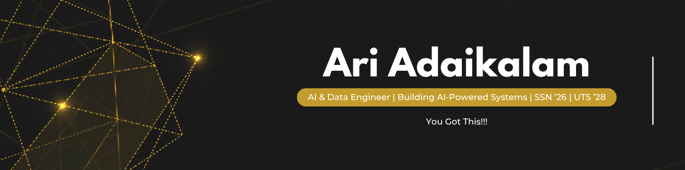

  

 

> ### Hi, I'm Ari 👋
> I'm an Electrical & Electronics Engineering graduate currently pursuing a Master of Artificial Intelligence at UTS.
>
> I build systems at the intersection of AI, machine learning, data engineering, software, and engineering with a particular interest in industrial intelligence, energy systems, intelligent automation, and applied AI.

 

