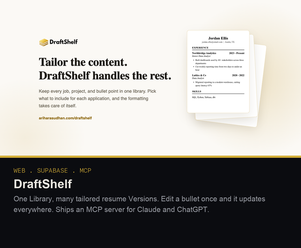
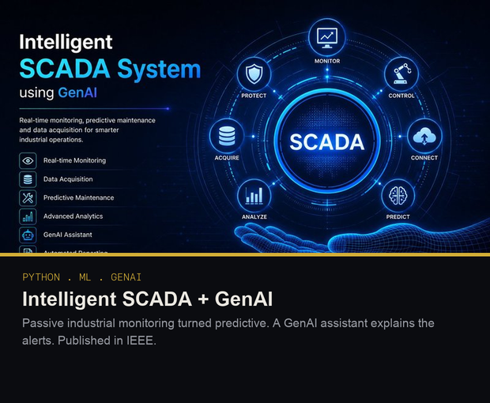
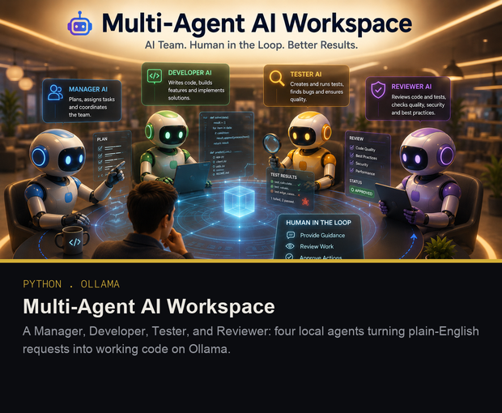
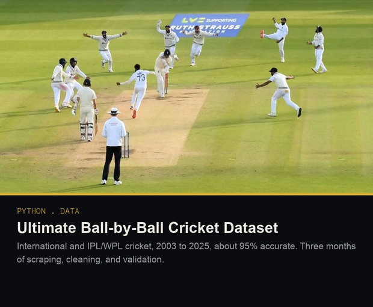

  

 

> A passionate AI Product Engineer with hands-on experience building intelligent systems. I bridge the gap between raw data and real-world impact by designing dashboards, automation pipelines, and AI-powered solutions that teams actually use.
>
> Currently pursuing my Masters in Artificial Intelligence at University of Technology Sydney (UTS). I've led teams, shipped production systems, and published IEEE research, all before finishing undergrad.
>
> Beyond data and code, I've captained an E-Kart racing team to a national top-3 finish.

 

## Featured

<table>
<tr>
<td width="50%" valign="top">

<a href="https://ariharasudhan.com/draftshelf/">Live site</a> &nbsp;·&nbsp; <a href="https://github.com/ari-adaikalam/DraftShelf">Repo</a>

</td>
<td width="50%" valign="top">

<a href="https://swat-dashboard-hlxg.onrender.com/">Live demo</a> &nbsp;·&nbsp; <a href="https://github.com/Ariharasudhan-Adaikalam/Intelligent-SCADA-System-using-GenAI">Repo</a>

</td>
</tr>
<tr>
<td width="50%" valign="top">

<a href="https://github.com/ari-adaikalam/Multi-Agent-AI-Workspace">Repo</a>

</td>
<td width="50%" valign="top">

<a href="https://www.kaggle.com/datasets/ariadaikalam/the-ultimate-ball-by-ball-cricket-dataset">Kaggle</a> &nbsp;·&nbsp; <a href="https://github.com/Ariharasudhan-Adaikalam/The-Ultimate-Ball-by-Ball-Cricket-Dataset">Repo</a>

</td>
</tr>
</table>

 

### More Projects

- 🤖 **[WikiBot](https://github.com/ari-adaikalam/WikiBot)**: a RAG chatbot over live Wikipedia, built with LangChain, HuggingFace, and Chroma
- 🏏 **[Kohli-KNN](https://github.com/ari-adaikalam/Finding-The-Closest-Player-To-Virat-Kohli-In-The-Entire-IPL-Using-K-Nearest-Neighbor-KNN)**: the nearest IPL player by phase-wise performance, found with K-Nearest Neighbors
- 📊 **Tableau dashboards**: [IPL auctions](https://github.com/ari-adaikalam/IPL-Auction-History-Analysis-Tableau-Dashboard), [H&M sales](https://github.com/ari-adaikalam/H-M_Sales_Analysis_Tableau_Dashboard), and [video game sales](https://github.com/ari-adaikalam/Video-Games-Sales-Analysis-Tableau-Dashboard)
- 🏎️ **[Wind turbine housing for EVs](https://github.com/ari-adaikalam/Wind-Turbine-Housing-Design-for-EVs)**: the racing background showing up in the repo list

 

## Working with

**Programming & Backend**
 
       

**DevOps & Tools**
 
       

**Data & Visualization**
 
       

**Databases**
 
     

**AI & ML**
 
       

**AI-Assisted Development**
 
  
